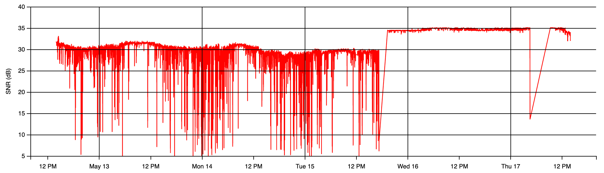
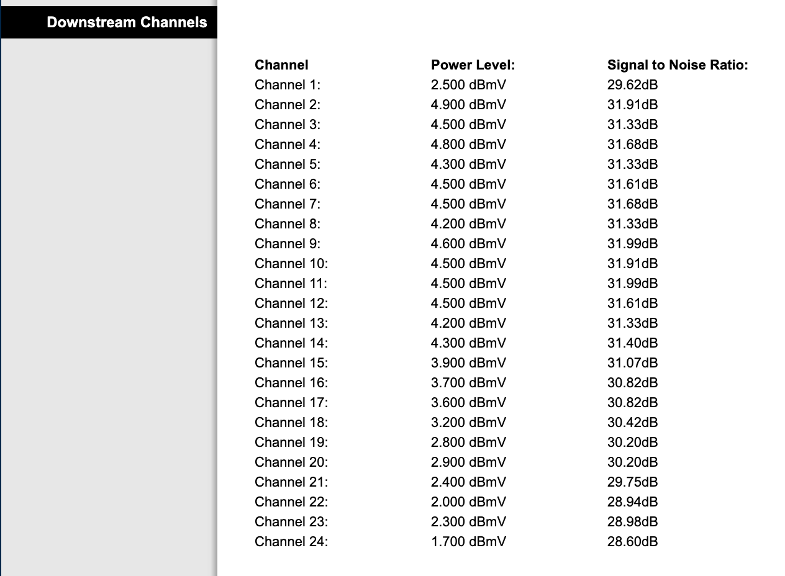
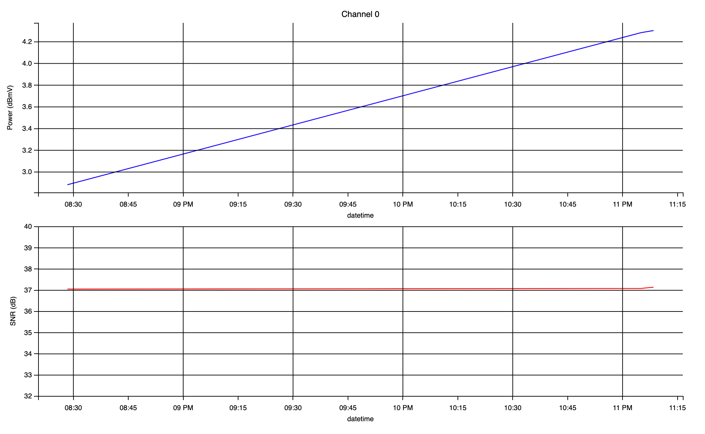

# cmstool



Cable Modem Statistics Tool 

## Table of contents

- [Introduction](#introduction)
- [Requirements](#requirements)
- [Supported devices](#supported-devices)
- [Installation](#installation)
- [Usage](#usage)
  - [Example](#example)
- [Schedule `cmscraper` execution](#schedule-cmscraper-execution)
- [Real case study (4G interference)](#real-case-study-4g-interference)
- [How to contribute](#how-to-contribute)
- [Final notes](#final-notes)


## Introduction

`cmstool` can be used to generate SNR and Power statistics for cable modems by scraping this data from modem's Web UI interface. The statistics generated can help to identify a source of interference in one or multiple DOCSIS channels, that could lead to a degradation of the downstream signal.

The tool is composed by two main scripts:

* `cmsraper`: command line tool used to scrape SNR and Power values from cable modem's Web UI interface and store them in a `.csv` file.

* `cmstats`: command line tool used to parse `.csv` file and generate statistics.

## Requirements

- Python 3.x
- Pip
- Docker (for cmstats)

## Supported devices

For this beta version just only one:

- Technicolor DPC3848VE

## Installation

`cmscraper` can be installed using [pip](https://pypi.org/project/cmstool/):
```
pip install cmstool
```

`cmstats` can be executed using Docker. You can find the docker image in [dockerhub](https://hub.docker.com/repository/docker/charlysan/cmstats)

## Usage

Just run the tool with `--help` argument to get a list of supported commands:
```
$ cmscraper_cli --help
usage: cmscraper_cli [-h] [-d DEVICE_NAME] [-i MODEM_IP_ADDRESS] [-o OUTPUT_PATH] [-t HTTP_TIMEOUT]

A Python tool that extracts statistics data from modem status web page.

optional arguments:
  -h, --help           show this help message and exit
  -d DEVICE_NAME       Device Name (Supported devices: technicolor-dpc384ve)
  -i MODEM_IP_ADDRESS  Modem IP Address (Default: 192.168.0.1)
  -o OUTPUT_PATH       Output path to store statistics
  -t HTTP_TIMEOUT      HTTP Client Timeout (Default: 10s)
```

### Example
Now, supposing your modem's gateway is `192.168.0.1`. If you go to the Web UI interface you might see something like this:



Try to scrape some data to `./stats` folder:

```
$ cmscraper_cli -d technicolor-dpc384ve -o ./stats
```

Check `./stats` directory, you should see a list of `.csv` files (one per channel):
```
$ ls stats/
0.csv  10.csv 12.csv 14.csv 16.csv 18.csv 2.csv  21.csv 23.csv 3.csv  5.csv  7.csv  9.csv
1.csv  11.csv 13.csv 15.csv 17.csv 19.csv 20.csv 22.csv 24.csv 4.csv  6.csv  8.csv
```

Have a look at one of those:
```
$ cat stats/14.csv
1606075264,3.4,37.63
1606076909,3.5,37.35
1606086304,5.0,37.35
1606086513,5.0,37.35
```

Each row contains the following columns: `timestamp`, `power` and `snr`

You should be ready to get some statistics using `cmstats` cli tool:

```
docker run -it --rm \
-p 8888:8888 \
-v ${PWD}/stats:/opt/cmstats/data  \
charlysan/cmstats \
--chr 0 24
```

The above will execute cmstats cli tool and map `./stats` folder to `/opt/cmstats/data` on your container 
(the default path containing your `.csv` files) and parse channel range through 0 to 24. 

**Note**: channel `0` is the average value of the whole set of channels.

Expected results:

```
Ch 00: PWR avg: 03.82 dBmV / PWR std: 00.66 - SNR avg: 37.08 dB  / SNR std: 00.04
Ch 01: PWR avg: 02.67 dBmV / PWR std: 00.75 - SNR avg: 36.53 dB  / SNR std: 00.11
Ch 02: PWR avg: 04.97 dBmV / PWR std: 00.47 - SNR avg: 37.54 dB  / SNR std: 00.13
Ch 03: PWR avg: 04.60 dBmV / PWR std: 00.50 - SNR avg: 37.44 dB  / SNR std: 00.13
Ch 04: PWR avg: 04.87 dBmV / PWR std: 00.47 - SNR avg: 37.44 dB  / SNR std: 00.13
Ch 05: PWR avg: 04.37 dBmV / PWR std: 00.47 - SNR avg: 37.44 dB  / SNR std: 00.13
Ch 06: PWR avg: 04.50 dBmV / PWR std: 00.50 - SNR avg: 37.54 dB  / SNR std: 00.13
Ch 07: PWR avg: 04.43 dBmV / PWR std: 00.52 - SNR avg: 37.44 dB  / SNR std: 00.13
Ch 08: PWR avg: 04.07 dBmV / PWR std: 00.47 - SNR avg: 36.95 dB  / SNR std: 00.48
Ch 09: PWR avg: 04.43 dBmV / PWR std: 00.52 - SNR avg: 37.54 dB  / SNR std: 00.13
Ch 10: PWR avg: 04.63 dBmV / PWR std: 00.66 - SNR avg: 37.44 dB  / SNR std: 00.13
Ch 11: PWR avg: 04.63 dBmV / PWR std: 00.66 - SNR avg: 37.54 dB  / SNR std: 00.13
Ch 12: PWR avg: 04.63 dBmV / PWR std: 00.73 - SNR avg: 37.44 dB  / SNR std: 00.13
Ch 13: PWR avg: 04.40 dBmV / PWR std: 00.71 - SNR avg: 37.54 dB  / SNR std: 00.13
Ch 14: PWR avg: 04.50 dBmV / PWR std: 00.71 - SNR avg: 37.35 dB  / SNR std: 00.00
Ch 15: PWR avg: 04.07 dBmV / PWR std: 00.75 - SNR avg: 37.35 dB  / SNR std: 00.00
Ch 16: PWR avg: 03.83 dBmV / PWR std: 00.73 - SNR avg: 36.93 dB  / SNR std: 00.31
Ch 17: PWR avg: 03.77 dBmV / PWR std: 00.75 - SNR avg: 36.86 dB  / SNR std: 00.35
Ch 18: PWR avg: 03.30 dBmV / PWR std: 00.78 - SNR avg: 36.61 dB  / SNR std: 00.00
Ch 19: PWR avg: 02.97 dBmV / PWR std: 00.75 - SNR avg: 36.46 dB  / SNR std: 00.11
Ch 20: PWR avg: 03.03 dBmV / PWR std: 00.80 - SNR avg: 36.46 dB  / SNR std: 00.11
Ch 21: PWR avg: 02.53 dBmV / PWR std: 00.80 - SNR avg: 36.46 dB  / SNR std: 00.11
Ch 22: PWR avg: 02.13 dBmV / PWR std: 00.80 - SNR avg: 36.61 dB  / SNR std: 00.00
Ch 23: PWR avg: 02.43 dBmV / PWR std: 00.80 - SNR avg: 36.53 dB  / SNR std: 00.11
Ch 24: PWR avg: 01.90 dBmV / PWR std: 00.85 - SNR avg: 36.46 dB  / SNR std: 00.11

Serving to http://0.0.0.0:8888/    [Ctrl-C to exit]
172.17.0.1 - - [07/Dec/2020 03:23:43] "GET / HTTP/1.1" 200 -
```

From the above listing you could already arrive to a conclusion just by looking at the average (SNR avg) and standard deviation (SNR std) values, 
but if you want to see how the SNR varies over time you can open [http://0.0.0.0:8888](http://0.0.0.0:8888) in your browser 
and you should see something like this:




Acceptable SNR Levels should be around 30-35 or greater depending on the modulation type. However the above example would be useless 
as you only have 4 samples. To get a more significant result you need to take several samples in a long period of time, and to do that 
you will need to schedule the execution of `cmscraper_cli`.

## Schedule `cmscraper` execution

To get meaningful statistics results you need to gather several SNR samples in a long period of time (e.g. 8 hs.). To accomplish that 
you could schedule a cron job using [crontab](https://man7.org/linux/man-pages/man5/crontab.5.html), and execute `cmscraper_cli` every 
5 minutes:

```
*/5 * * * * /usr/local/bin/cmscraper_cli -d technicolor-dpc384ve -o /home/pi/stats
```

**Note**: always use full path when calling `cmscraper_cli` (`which cmscraper_cli`) and when specifying output folder.

For convenience I used a raspberry pi connected to the gateway, installed `cmscraper_cli` there and scheduled the cronjob as listed above. 

Then you could copy the `.csv` files to your computer using scp:

```
scp pi@192.168.0.34:/home/pi/stats/\*\.csv ./
```

Where `192.168.0.34` is my rpi ip address.

After that you should be able to parse your data using `cmstats`:
```
docker run -it --rm \
-p 8888:8888 \
-v ${PWD}:/opt/cmstats/data \
charlysan/cmstats \
--chr 0 24
```

## Real case study (4G interference)

Please refer to wiki [DOCSIS cable modem and 4G interference document](https://github.com/charlysan/cmstool/wiki/DOCSIS-cable-modem-and-4G-interference)

## How to contribute

The scraper tool could easily support many other devices. If you want to support a different device just create a Pull Request, 
extend [Scraper class](./cmscraper/scraper.py), update `cmscraper_cli` and add your files under [devices](./cmscraper/devices) folder. 
Don't forget to add a Unit Test like the [included one](cmscraper/devices/technicolor/test_dpc3848ve.py)

## Final notes

This is a beta version, so some bugs are expected. Error handling needs to be improved.