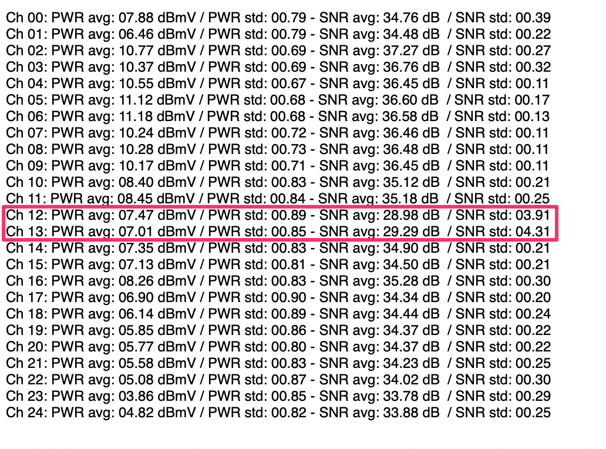
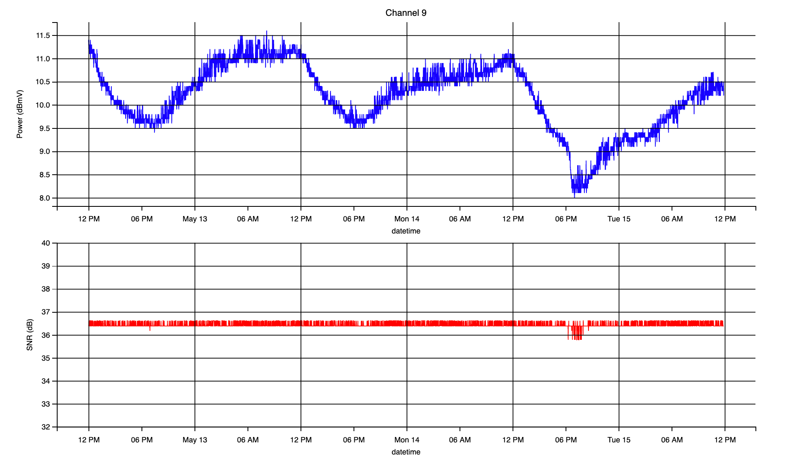
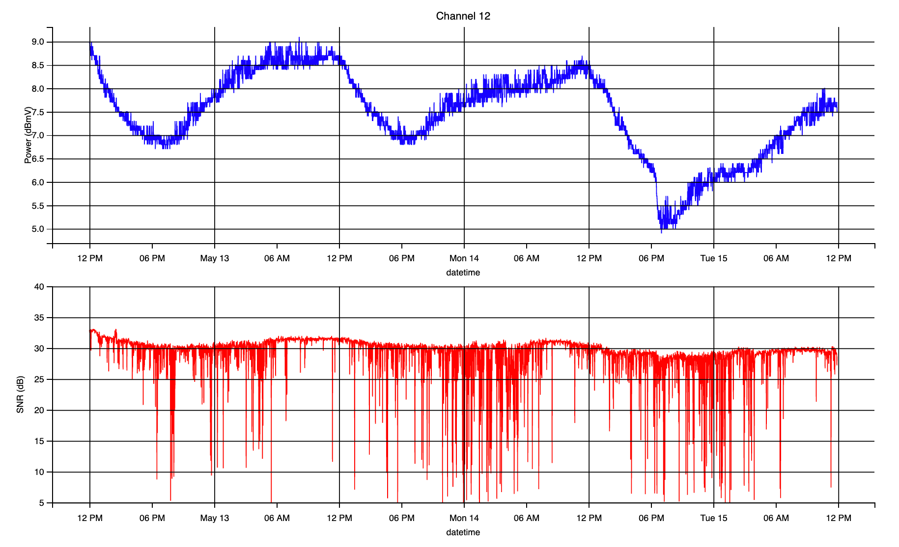
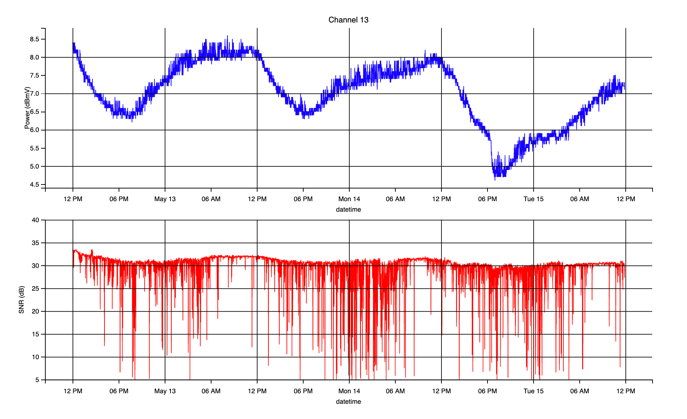
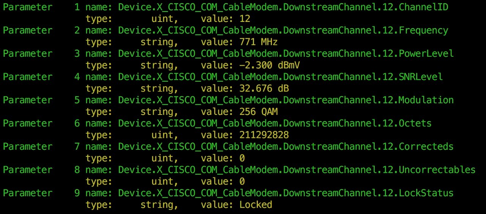
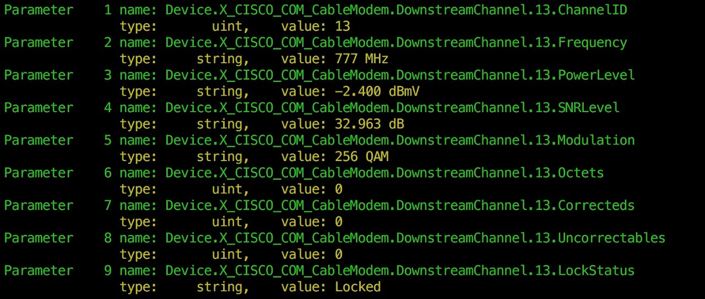
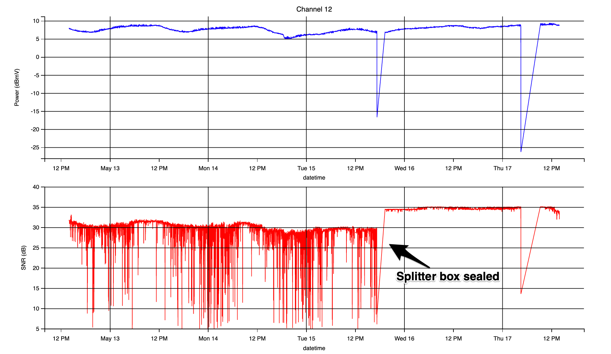

# DOCSIS Cable Modem 4G Interference

The purpose of this document is to show how to diagnose possible interference to DOCSIS cable modems by collecting SNR samples from modem's web UI interface status page, and analyze them using tools like `python` and `matplotlib`. 

## Introduction

The real purpose of `cmstool` was to try to find out why the downstream signal of my cable modem was suffering from heavy degradation. The problem persisted for many weeks, and my internet provider was not able to find a solution to the problem. 

### Hardware

* Technicolor DPC3848VE
* 50 mbps downstream
* 3 mbps upstream

### Symptoms 

* Upstream: OK
* Downstream: random degradation 
   - Sometimes I was getting full speed download (specially at night)
   - Long periods of time with very low download speed (~ 2 mbps)

So, I checked my cable modem's web ui interface and the only information I could get from there was the current SNR and Power of every channel; however this was not very helpful as the degradation I was suffering was not constant, some times I was getting full downstream speed (50 mbps) and some other times I only get around 2 mbps. During the time I was getting downstream issues some channels were showing low SNR values (~20 db). But I wanted to get a better view of how the SNR was changing in time, and maybe generate some plots. So I coded a simple scraper using `BeautifulSoup4` to collect the SNR values and store them as `csv` format, and then another tool to parse this information and show average values, standard deviation and plots. This is what I got:

```
docker run -it --rm \
-p 8888:8888 -v ${PWD}:/opt/cmstats/data  cmstats \
chr 0 24  \
since '2018-05-12 14:00:00' \
till '2018-05-15 14:00:00'
```



From the above, average values don't look that bad but standard deviation for channel 12 and 13 was **very high**. This could mean that those two channels were affected by some interference. The plots for a channel not affected by  interference looked like this:



However, channels 12 and 13 were very messed up:

 




There was no doubt now that some source of interference was affecting. At that moment I wanted to know the frequency and modulation for those channels, however the web ui interface does not provide that information. So, I reverse engineered  the firmware (beyond the scope of this this document) and gained access to CISCO cli console. This is what I got:






I then did a quick research and found out that in my country the following frequencies were assigned for **4G** communication: 

- 703-713 MHz & 758-768 MHz (Comp. A)
- 713-723 MHz & 768-778 MHz (Comp. B)
- 723-738 MHz & 778-793 MHz (Comp. C)


`Comp. B` 4G Antenna might be a possible culprit. Furthermore, for `256 QAM` SNR values of 33 dB or more is [recommended](https://pickmymodem.com/signal-levels-docsis-3-03-1-cable-modem/). 
So, I went to my building's rooftop to have a look and I could clearly see there was a 4G antenna in another building next to mine.

With this evidence I called my internet provider one more time. I explained them the problem, but they didn't know what to do about it. Finally, with the help of a friend, I managed to get a technician to check the building's main splitter box. It turned out that the splitter case shield door was not properly closed, there was a gap (around 1 cm. long) that allowed 4G signal to go through and affect some splitters. After he properly sealed the box, the problem was gone. This plot shows the exact moment before and after the fix:

